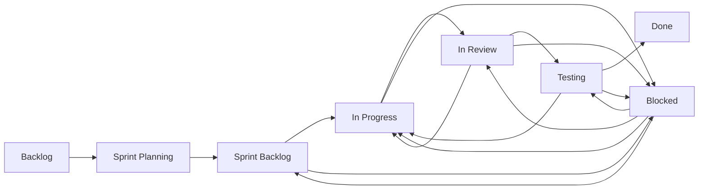

# Change Management Workflow Example

This example demonstrates how to use Circuit Breaker's DSL to implement a change management workflow system. The workflow models how issues move through different states in a sprint-based development process, from backlog to production.

## Overview

The workflow models a typical agile development process:



## Prerequisites

1. Install NATS Server:
   ```bash
   # macOS using Homebrew
   brew install nats-server

   # Alternative: Download from https://nats.io/download/
   ```

2. Install required Ruby gems:
   ```bash
   gem install nats-pure
   ```

## Project Structure

```
change_management/
├── README.md                 # This file
├── change_workflow.rb        # Main workflow definition using DSL
├── run_change_workflow.sh    # Script to run the example
└── functions/               # State transition handlers
    ├── sprint_planning_function.rb
    └── review_function.rb
```

## Workflow Definition Using DSL

The workflow is defined using a readable Domain Specific Language (DSL) that makes it easy to understand and modify the workflow:

```ruby
CircuitBreaker::WorkflowDSL.define do
  # Define all possible states
  states :backlog, :sprint_planning, :sprint_backlog,
        :in_progress, :in_review, :testing, :done

  # Define special states that can be entered from multiple places
  special_states :blocked

  # Define the main flow of the workflow
  flow from: :backlog,         to: :sprint_planning,  via: :move_to_sprint
  flow from: :sprint_planning, to: :sprint_backlog,   via: :plan_issue
  flow from: :sprint_backlog,  to: :in_progress,      via: :start_work
  flow from: :in_progress,     to: :in_review,        via: :submit_for_review
  flow from: :in_review,       to: :testing,          via: :approve_review
  flow from: :testing,         to: :done,             via: :pass_testing

  # Define reverse flows (when work needs to go back)
  flow from: :in_review,       to: :in_progress,      via: :reject_review
  flow from: :testing,         to: :in_progress,      via: :fail_testing

  # Define blocking flows that can happen from multiple states
  multi_flow from: [:sprint_backlog, :in_progress, :in_review, :testing],
            to: :blocked,
            via: :block_issue

  # Define unblocking flows
  multi_flow from: :blocked,
            to_states: [:sprint_backlog, :in_progress, :in_review, :testing],
            via: :unblock_issue
end
```

### DSL Components

1. **State Definition**
   ```ruby
   # Regular states
   states :backlog, :sprint_planning, :sprint_backlog
   
   # Special states (can be entered from multiple places)
   special_states :blocked
   ```

2. **Simple Flow Definition**
   ```ruby
   flow from: :backlog, to: :sprint_planning, via: :move_to_sprint
   ```
   - `from`: Source state
   - `to`: Target state
   - `via`: Name of the transition

3. **Multi-State Transitions**
   ```ruby
   multi_flow from: [:sprint_backlog, :in_progress],
             to: :blocked,
             via: :block_issue
   ```
   - Handles transitions that can happen from multiple states
   - Or transitions that can go to multiple states

## Running the Example

1. Start everything using the provided script:
   ```bash
   ./run_change_workflow.sh
   ```

   This script will:
   - Start NATS server if not running
   - Launch all function workers
   - Run the main workflow
   - Handle cleanup on exit

2. Watch the workflow progress through the console output
3. Press Ctrl+C to stop all workers and exit

## Extending the Workflow

### 1. Adding New States and Flows

```ruby
CircuitBreaker::WorkflowDSL.define do
  # Add deployment states
  states :deployment_ready, :in_production
  
  # Add deployment flows
  flow from: :done,             to: :deployment_ready, via: :prepare_deploy
  flow from: :deployment_ready, to: :in_production,    via: :deploy
  
  # Add rollback flow
  flow from: :in_production,    to: :deployment_ready, via: :rollback
end
```

### 2. Adding Complex State Management

```ruby
CircuitBreaker::WorkflowDSL.define do
  # Add states for different environments
  states :dev_ready, :staging_ready, :prod_ready
  
  # Add validation states
  special_states :needs_security_review, :pending_approval
  
  # Define environment progression
  flow from: :done,        to: :dev_ready,      via: :deploy_to_dev
  flow from: :dev_ready,   to: :staging_ready,  via: :promote_to_staging
  flow from: :staging_ready, to: :prod_ready,   via: :promote_to_prod
  
  # Define validation flows
  multi_flow from: [:dev_ready, :staging_ready, :prod_ready],
            to: :needs_security_review,
            via: :request_security_review
end
```

### 3. Adding State Metadata (Coming Soon)

```ruby
CircuitBreaker::WorkflowDSL.define do
  # Define states with metadata
  state :in_review,
    description: "Code review in progress",
    required_approvals: 2,
    notify: [:team_lead, :qa_team],
    metrics: [:time_in_review, :approval_count]
    
  # Define transitions with guards
  flow from: :testing, to: :done, via: :pass_testing do
    guard { |issue| issue.tests_passing? && issue.security_scan_passed? }
    notify :deployment_team
    track_metric :time_to_completion
  end
end
```

## Troubleshooting

1. **NATS Connection Issues**
   - Verify NATS is running: `nats-server -DV`
   - Check default port (4222) is available
   - Ensure no firewall blocking

2. **Worker Startup Problems**
   - Check log output for each worker
   - Verify all required gems are installed
   - Ensure proper file permissions

3. **State Transition Errors**
   - Verify state names in DSL match worker configurations
   - Check for typos in state or transition names
   - Ensure all required functions are running

## Contributing

Feel free to submit issues and enhancement requests! Some areas for contribution:
- Additional DSL features
- New state transition handlers
- Integration with external systems
- Workflow templates for common patterns
