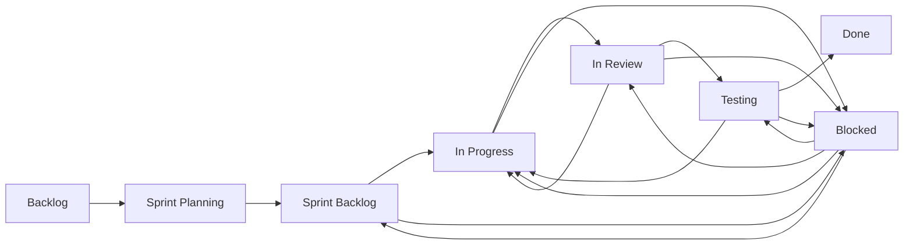

# Change Management Workflow Example

This example demonstrates how to use Circuit Breaker to implement a change management workflow system that models how issues move through different states in a sprint-based development process.

## Overview

The workflow models a typical agile development process where issues move through various states:



## Prerequisites

1. Install NATS Server:
   ```bash
   # macOS using Homebrew
   brew install nats-server

   # Alternative: Download from https://nats.io/download/
   ```

2. Install required Ruby gems:
   ```bash
   gem install nats-pure
   ```

## Project Structure

```
change_management/
├── README.md                 # This file
├── change_workflow.rb        # Main workflow definition
├── run_change_workflow.sh    # Script to run the example
└── functions/               # State transition handlers
    ├── sprint_planning_function.rb
    └── review_function.rb
```

## Workflow States

1. **Backlog**
   - Initial state for all new issues
   - Issues wait here until selected for a sprint

2. **Sprint Planning**
   - Issues are estimated and prioritized
   - Story points are assigned
   - Sprint goals are set

3. **Sprint Backlog**
   - Issues ready to be worked on in the current sprint
   - Prioritized and fully specified

4. **In Progress**
   - Active development work happening
   - Can be blocked if dependencies arise

5. **In Review**
   - Code review in progress
   - Can be approved or sent back for changes

6. **Testing**
   - QA and automated testing
   - Can pass and move to done, or fail and return to in progress

7. **Done**
   - Issue is complete and deployed
   - All acceptance criteria met

8. **Blocked**
   - Special state that can be entered from any active state
   - Issues can return to their previous state when unblocked

## Running the Example

1. Start everything using the provided script:
   ```bash
   ./run_change_workflow.sh
   ```

   This script will:
   - Start NATS server if not running
   - Launch all function workers
   - Run the main workflow
   - Handle cleanup on exit

2. Watch the workflow progress through the console output
3. Press Ctrl+C to stop all workers and exit

## Function Workers

### Sprint Planning Function
- Handles moving issues from backlog to sprint
- Implements:
  - Story point estimation
  - Sprint assignment
  - Priority updates
  - Sprint goal setting

### Review Function
- Manages the code review process
- Features:
  - Code quality metrics tracking
  - Automated test verification
  - Review comment management
  - Approval/rejection decisions

## Extending the Example

You can extend this example in several ways:

1. **Add More Functions**
   - Testing function for automated QA
   - Deployment function for production releases
   - Metrics collection function for analytics

2. **Add New State Transitions**
   ```ruby
   # In change_workflow.rb
   wf.add_transition('cancel_issue')
   wf.add_transition('postpone_to_next_sprint')
   ```

3. **Integrate with External Systems**
   ```ruby
   # Example integration with JIRA
   def update_jira_status(issue_id, status)
     # Integration code here
   end
   ```

4. **Add Complex Business Rules**
   ```ruby
   # Example: Require two approvals for high-priority issues
   def can_approve?(issue)
     return issue.approvals.count >= 2 if issue.priority == 'high'
     return issue.approvals.count >= 1
   end
   ```

5. **Implement Metrics Collection**
   ```ruby
   # Example: Track time in each state
   def track_state_duration(issue, state)
     # Metrics collection code here
   end
   ```

## Troubleshooting

1. **NATS Connection Issues**
   - Verify NATS is running: `nats-server -DV`
   - Check default port (4222) is available
   - Ensure no firewall blocking

2. **Worker Startup Problems**
   - Check log output for each worker
   - Verify all required gems are installed
   - Ensure proper file permissions

3. **State Transition Errors**
   - Check workflow definition for valid connections
   - Verify all required functions are running
   - Review event stream for missing handlers

## Contributing

Feel free to submit issues and enhancement requests!
