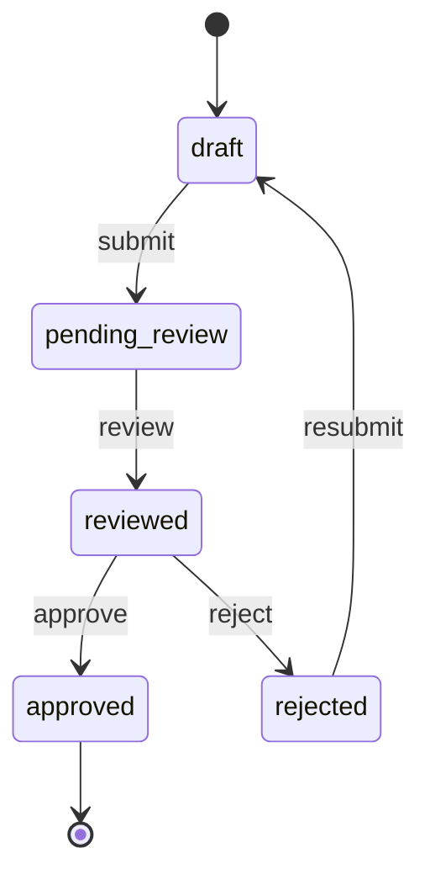

# Document Workflow Example

This example demonstrates how to use the Circuit Breaker library to implement a document workflow system with state transitions, validations, and history tracking.

## Features Demonstrated

- State transitions (draft → pending_review → reviewed → approved/rejected)
- Attribute validations (title, content, dates, etc.)
- Custom transition rules
- Event handling (sync and async)
- History tracking
- Timeline visualization
- Multiple export formats (HTML, Markdown)

## Files

- `document_token.rb`: The Document class implementation
- `example.rb`: Example usage of the Document workflow
- `workflow_mermaid.html`: Generated workflow visualization using Mermaid
- `workflow_markdown.md`: Generated workflow documentation in Markdown
- `document_timeline.html`: Generated timeline of document history

## Usage

Run the example:

```bash
ruby example.rb
```

This will:
1. Create a new document
2. Submit it for review
3. Review and approve the document
4. Generate visualizations and history timeline
5. Print the document's history

## State Machine



## Validation Rules

- Title must be present and start with a capital letter
- Content must be present and at least 10 characters
- Reviewer must be different from author
- Reviewer comments required for reviewed state
- Approver must be different from author and reviewer
- Rejection reason required for rejected state

## Event Handling

The example demonstrates both synchronous and asynchronous event handling:

- State changes
- Attribute modifications
- Transition failures
- Async notifications

## History Tracking

Every state transition and attribute change is recorded with:

- Timestamp
- Actor ID
- Event type
- Event details

The history can be viewed in a beautiful timeline visualization (see `document_timeline.html`).
